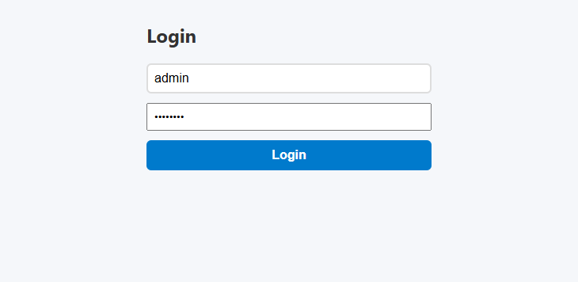
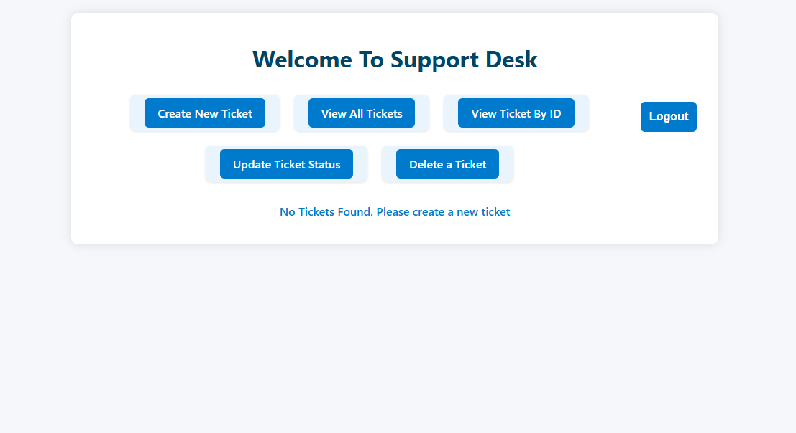
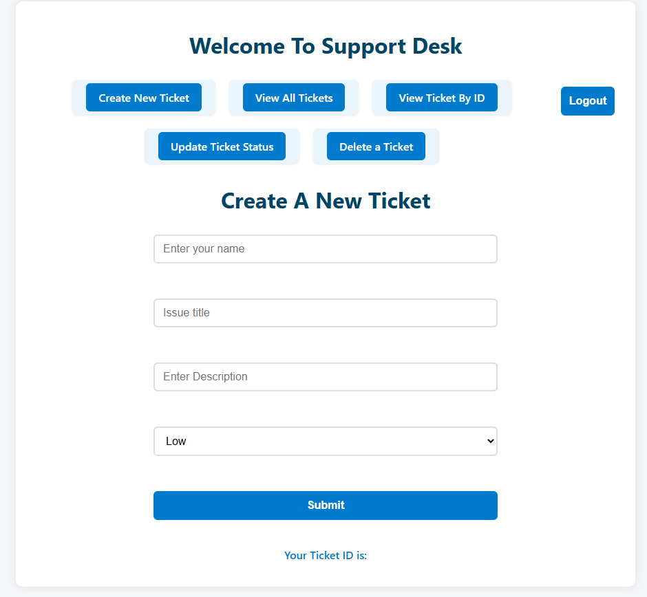
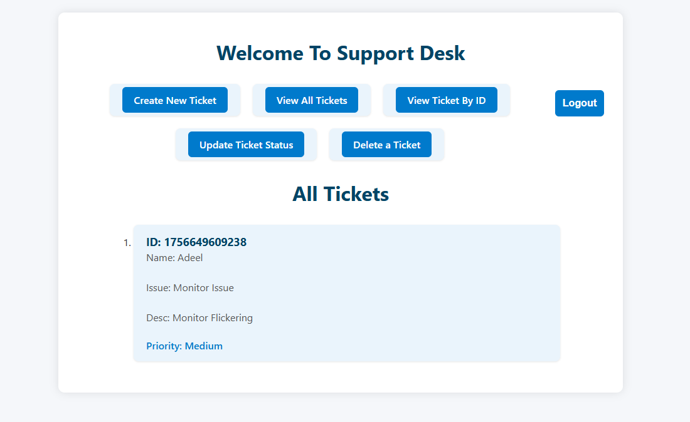
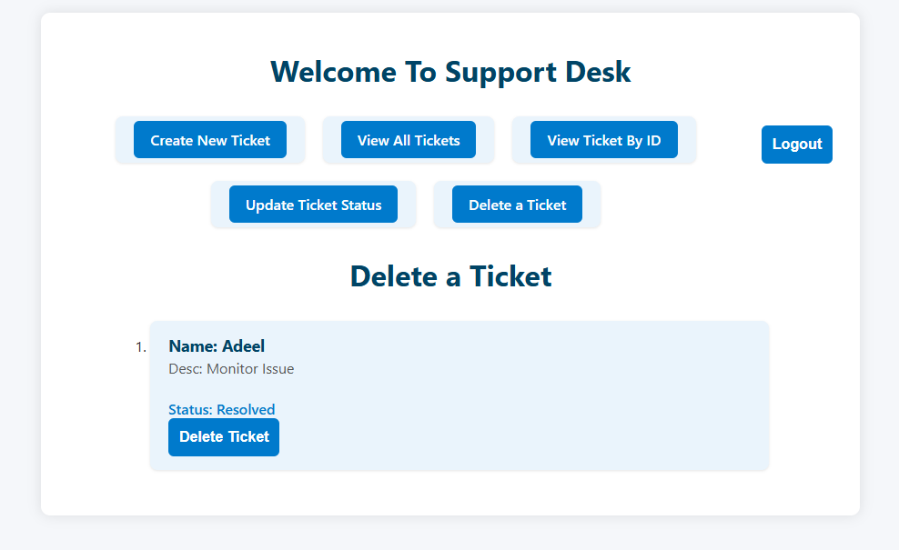
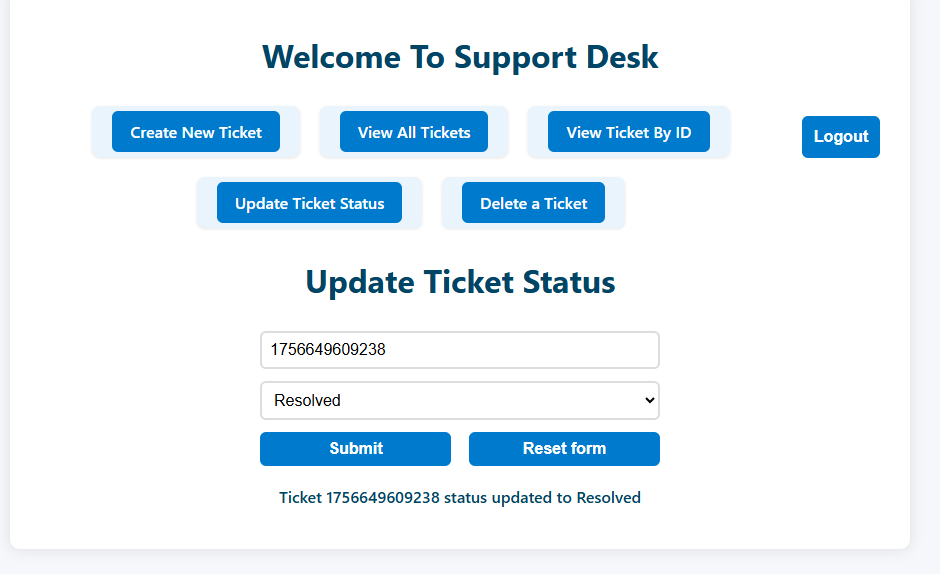

# 🎟️ Ticketing System (React)

The Ticketing System is a React-based issue tracking application that simulates real-world support workflows. Users can log in, create tickets, update their status, and view them across different pages. The project demonstrates routing, reusable components, and a modular structure for scalability.

🔗 [Live Demo](https://adeelh12.github.io/support-desk/)  
📂 [GitHub Repo](https://github.com/AdeelH12/Ticketing-System)  
🧑‍💻 **Demo Login**: `admin` / `password`

---

## ✨ Features

- 🔐 **Login Page**: Secure demo authentication (admin/password).  
- ➕ **Create Tickets**: Add new issues with title, description, and status.  
- 📋 **View Tickets**: See a list of open and resolved tickets.  
- 📝 **Update Tickets**: Change status or edit details.  
- ❌ **Delete Tickets**: Remove tickets when no longer needed.  
- 🔀 **Multi-Page Navigation**: Implemented with React Router.  
- ♻️ **Reusable Components**: Consistent and modular design for scalability.  

---

## 🛠️ Tech Stack

- **Frontend**: React.js  
- **Routing**: React Router  
- **State Management**: useState, useEffect  
- **Styling**: CSS3  

---

## 📸 Screenshots

### 🔐 Login Page


### 🏠 Landing Page


### ➕ Create Ticket


### 📋 All Tickets


### ❌ Delete Ticket


### 🔄 Update Status


## 🔮 Future Improvements

- Implement a real backend (Node.js + database such as MongoDB or Firebase).
- Add role-based authentication (admin, user, support agent).
- Introduce ticket categories & priorities for better filtering.
- Add search and sort functionality.
- Improve UI/UX with a modern styling library (Tailwind CSS or Material UI).

## 📚 What I Learned

- Building a multi-page app using React Router.
- Managing authentication logic in React.
- Structuring reusable and modular React components.
- Simulating real-world ticketing workflows in a front-end project.
- Planning for scalability and future backend integration.

## 🚀 Getting Started

Clone the repository and install dependencies:

```bash
git clone https://github.com/AdeelH12/Ticketing-System.git
cd Ticketing-System
npm install
npm start
```
